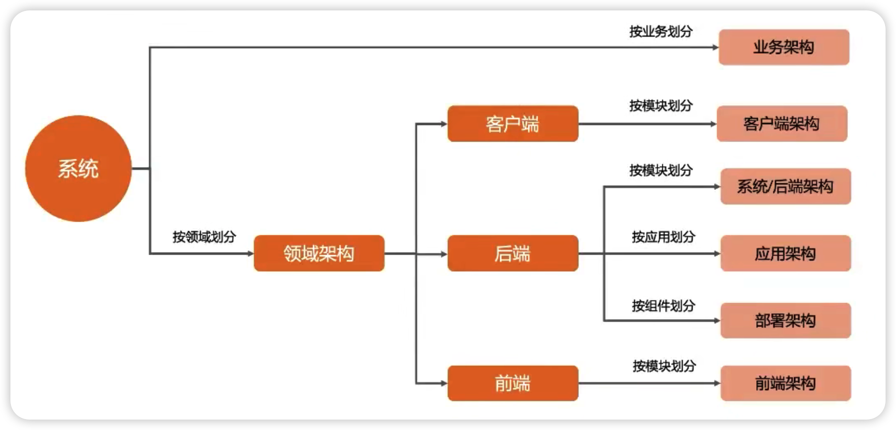

1.软件架构
软件架构指的是软件系统的顶层设计（Rank），它定义了系统由哪些角色（Role）组成，角色之间的关系（Relation）和运作规则（Rule），如下图所示。


````
业务架构
对应我们 4R 中的 Rank，也就是顶层结构。
业务架构指的是使用一套方法论/逻辑对产品（项目）所涉及到的业务进行边界划分，核心点就是把业务边界通过不同颜色模块标识出来，并做分组，同时不需要去考虑具体技术点。

应用架构
应用架构是对整个系统实现的总体上的架构，需要指出系统的层次、系统开发的原则、系统各个层次的应用服务，通过不同的颜色来标识角色，自顶向下分层设计。

技术架构
对应我们 4R 中的 Relation，也就是角色关系。
应用架构本身只关心需要哪些应用系统，哪些平台来满足业务目标的需求，而不会关心在整个构建过程中你需要使用哪些技术。
技术架构则是应接应用架构的技术需求，并根据识别的技术需求，进行技术选型，把各个关键技术和技术之间的关系描述清楚。技术架构解决的问题包括：纯技术层面的分层、开发框架的选择、开发语言的选择、涉及非功能性需求的技术选择。

````

架构设计的领域是很多的，比如业务架构，系统架构，技术架构，模型架构等等。。。

为什么要画架构图
既然架构的过程就是建模的过程，为什么我们要费时费力的去画架构图呢？直接用代码或者文字体现不就行了吗？我觉得这个问题可以从 2 点方面来回答：


从技术角度来讲：架构图相比其他表现方式，可以更方便的表明当前系统的结构体系，减少同事或者与客户之间的认知障碍，达到统一认知。
从阅读角度来讲：图的表现力远远高于文字的表现力，这也是为什么人们常说“一图胜千言，NO 图 NO BB”。

2.架构图分类


````
2.1 搞清楚要画的架构图的类型
2.2 抽离架构图中的关键要素
2.3 梳理各个要素之间的关系：包含关系 、引用关系、同级关系等等
2.4 根据以上信息串联起来，并标识清楚。
````


微服务的优点
````
微服务架构模式有许多非常好的地方。
第一，它解决了复杂问题。它把可能会变得庞大的单体应用程序分解成一套服务。
第二，这种架构使得每个服务都可以由一个团队独立专注开发。开发者可以自由选择任何符合服务 API 契约的技术。
第三，微服务架构模式可以实现每一个微服务独立部署。
````

 IoC和DI的简单含义
 ````
1.1 什么是IOC？
Ioc—Inversion of Control，即控制反转，其是一种设计思想，而不是一种技术。再没有使用IOC之前，我们一般是通过new来实例化，从而创建一个对象。但是我们使用IOC之后，创建这个对象的控制权将由内部转换到外部，那么这个过程便可以理解为控制反转。

1.2 什么是DI(依赖注入）？
全称为Dependency Injection，意思自身对象中的内置对象是通过注入的方式进行创建。形象的说，即由容器动态的将某个依赖关系注入到组件之中。

IOC是一种设计思想，而DI是这种设计思想的一个实现。理解IOC和DI的关键是：“谁依赖谁，为什么需要依赖，谁注入谁，注入了什么”。

●谁依赖于谁：当然是应用程序依赖于IoC容器；
●为什么需要依赖：应用程序需要IoC容器来提供对象需要的外部资源；
●谁注入谁：很明显是IoC容器注入应用程序某个对象，应用程序依赖的对象；
●注入了什么：就是注入某个对象所需要的外部资源（包括对象、资源、常量数据）

1.4 为啥需要反转？
为了在业务变化的时候尽量减少改动代码造成的问题。
1.5 使用DI的好处？
1）让程序之间松散耦合，减少依赖，有利于功能复用。
2）让程序整体结构更加灵活，有利于单元测试。

通常来说，依赖注入是为了控制反转，就是说不需要我们自己去new服务实例了。
 ````
 
 算法
 ```
 算法就是，由一个输入，到一个输出，中间经历的步骤。从A到B有很多条路，这一条条路就是一个个从A到B的算法。
一个算法的好坏可以从运行所需要的时间和所消耗的资源两个维度来判断。
 ```


